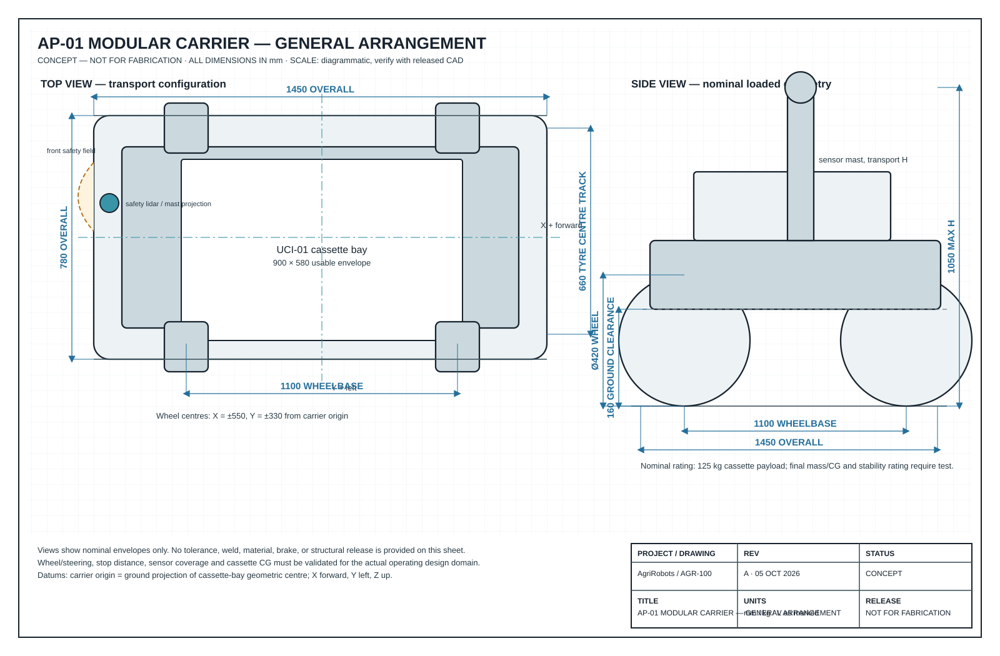

# AgriRobots — modular agricultural mobile robot concept

> **Concept revision A · 05 October 2026 · millimetres unless noted**
> This is a **design and execution package**, not a certified machine or fabrication release. A site survey, detailed hazard analysis, structural analysis, and local food/chemical/regulatory approval are mandatory before a build is released for autonomous operation.

## The proposal in one sentence

Build one safety-supervised, battery-electric **AP-01 carrier** and change its payload cassette—not the whole robot—to collect eggs, distribute feed, clean/sanitize, or perform conservative vision-guided early-stage weeding.

The carrier deliberately has a fixed protected mobility/safety/compute stack. Each task cassette has a mechanical, electrical, data, and capability contract. This makes the vehicle reusable while keeping the safety case and maintenance boundary understandable.



## Design package

| Artifact | What it answers |
| --- | --- |
| [Design basis and requirements](docs/00_DESIGN_BASIS.md) | Operating envelope, scope limits, measurable requirements, site facts still needed |
| [Mechanical design](docs/01_MECHANICAL_DESIGN.md) | Carrier, universal cassette interface, mass/CG budget, task modules, fabrication notes |
| [Controls, ROS 2, and Sapo-style DSL](docs/02_CONTROLS_SOFTWARE_AND_DSL.md) | ROS 2 architecture, independent safety boundary, module API, simulation, task DSL and examples |
| [AgriScript DSL artifacts](dsl/README.md) | Draft JSON Schema plus feed, egg, sanitation, and conservative-weeding recipe examples |
| [Execution plan and verification](docs/03_EXECUTION_PLAN_AND_VV.md) | 52-week staged plan, gates, pilot acceptance tests, risk register |
| [Implementation plan](docs/08_IMPLEMENTATION_PLAN.md) | White-paper-to-build roadmap for the Virtual Lab, simulation/AI, AgriScript, edge runtime, hardware, and fleet workstreams |
| [Preliminary BOM and make/buy plan](docs/04_PRELIMINARY_BOM.md) | Costed work packages and procurement-critical items |
| [Hardware build guidelines](docs/07_HARDWARE_BUILD_GUIDE.md) | Workshop-level build sequence, tooling, wiring/bring-up rules, and gate-aligned checklists |
| [Safety, food, and chemical compliance plan](docs/05_SAFETY_AND_COMPLIANCE.md) | Safety functions, standards map, sanitation/egg constraints, operating rules |
| [Site-discovery questionnaire](docs/06_SITE_DISCOVERY_QUESTIONNAIRE.md) | The values needed to freeze a production design |
| [Drawing index](drawings/README.md) | Vector drawing sheets and drawing-control conventions |
| [Contributing guide](CONTRIBUTING.md) | Repository boundaries, verification commands, and change/evidence rules |

## Implementation workspace

The design package above is now backed by a scaffolded monorepo. Code lives in
explicit boundaries so the Virtual Lab, compiler, simulation, edge runtime and
fleet services stay separable — and so the safety controller stays independent of
all of them.

| Boundary | Status | Purpose |
| --- | --- | --- |
| [`packages/contracts`](packages/contracts/README.md) | implemented (types + schemas) | Versioned event, artifact and configuration contracts |
| [`packages/domain-model`](packages/domain-model/README.md) | implemented | AP-01/UCI-01/cassette identifiers and `agri.module/v1` manifest validation |
| [`packages/compiler-core`](packages/compiler-core/README.md) | partial | Strict YAML loading and `agri.script/v1` schema validation; semantic checks and the behaviour-tree IR are not implemented |
| [`packages/policy`](packages/policy/README.md) | partial | Draft capability allow-list with gate and approval checks |
| [`apps/virtual-lab`](apps/virtual-lab/README.md) | placeholder | Nuxt 4 assembly, manifest, recipe-review and twin-export studio |
| [`packages/asset-import`](packages/asset-import/README.md) | placeholder | GLTF/URDF ingestion and asset validation |
| [`ros_ws`](ros_ws/README.md) | placeholder | ROS 2 Jazzy edge packages, with the planned decomposition recorded |
| [`simulation`](simulation/README.md) | placeholder | Gazebo worlds, replay and power/safety HIL |
| [`ai`](ai/README.md) | placeholder | Dataset governance, training and evaluation |
| [`fleet`](fleet/README.md) | placeholder | Non-safety registry, staged rollout and audit |
| [`recipes`](recipes/README.md) | placeholder | Approved and signed recipes |
| [`test_evidence`](test_evidence/README.md) | template only | `VVT-*` records, reports and configuration hashes |

```bash
npm ci            # install workspace dependencies
npm run verify    # structure, links, types, lint, format, tests
```

Rules for changing any of it — boundaries, fail-closed validation, versioned
contracts, evidence and commit conventions — are in
[`CONTRIBUTING.md`](CONTRIBUTING.md).

## Physical concept at a glance

| Parameter | AP-01 baseline target |
| --- | ---:|
| Carrier overall envelope (bumpers) | 1,450 L × 780 W × 1,050 H mm |
| Wheelbase / nominal tyre-centre track | 1,100 / 660 mm |
| Ground clearance / wheel OD | 160 / 420 mm |
| Cassette envelope / nominal rated payload | 900 × 580 × 600 mm / 125 kg |
| Energy | 48 V nominal, 100 Ah LiFePO₄ (4.8 kWh nominal), removable keyed pack |
| Mobility | Four independent geared wheel modules; 4WD/4WS; electronically limited by mode/zone |
| Planned operating corridors | ≥1,000 mm barn aisle or a surveyed field headland/tramline; **not** an assumption that it straddles every crop row |
| Interchange method, revision A | Manual, de-energized exchange of one cassette; four captively retained M12 clamps plus keyed power/data connector |

The baseline supports poultry and **small-livestock** feeding. High-throughput cattle feed distribution, manure hauling, and outdoor operation on unsurveyed slopes require a larger/towable derivative and are intentionally out of the first release.

## Key design choices

- **One core, task cassettes:** AP-01 owns traction, braking, safety sensors, charging, localization, data logging, and a 900 × 580 mm cassette bay. Modules only declare capabilities and cannot bypass the safety controller.
- **ROS 2 remains the integration fabric—not the safety controller:** ROS 2 Jazzy on Ubuntu 24.04 runs mission, perception, navigation, and module behavior. A separate safety PLC/MCU watches E-stops, safety lidar, bumpers, tilt, heartbeat, and contactors.
- **Sapo-style declarative recipes:** A small typed YAML DSL compiles to an allow-listed behavior tree. Recipes are schema-checked, capability-checked, signed, bounded by zones/speed/chemical policy, and auditable. It is *inspired by* the requested Sapo-style approach; it does not claim compatibility with any external Sapo implementation.
- **Conservative vision for seedlings:** The weeding module only actuates when crop/weed/position confidence, latency, and safety envelope tests all pass. Uncertain plants are logged for human review—not removed.
- **Simulation before field action:** CAD/URDF + Gazebo/Harmonic (or Isaac Sim for photorealistic vision) provides the digital twin, fault scenarios, replay, and hardware-in-the-loop pathway. The Microduck inspiration is its open simulation-to-real workflow, not its bipedal geometry.

## Recommended build sequence

1. **Weeks 0–4 — discover:** measure aisles, floor/soil, flock/stock behavior, nest geometry, crop beds, routes, water/chemical handling, and local regulations using the questionnaire.
2. **Weeks 5–12 — de-risk the core:** build a non-autonomous carrier mule; prove brakes, steering, EMC, battery isolation, docking, cleanability, and cassette repeatability.
3. **Weeks 13–24 — prove benign modules first:** feeder and dry/wet cleaning tool in a fenced or supervised area. Finish safety case v1 before unsupervised navigation.
4. **Weeks 18–34 — egg pilot:** first collect into trays with no automatic egg treatment. Validate every food-contact/sanitation step separately with the farm/regulator.
5. **Weeks 20–44 — weed dataset and tool pilot:** collect labelled imagery across lighting/soil/cultivar/stage; operate tool only in a guarded test lane, then supervised field trials.
6. **Weeks 45–52 — integrated pilot:** only the modules meeting their acceptance gates are allowed in the operational pilot. No gate is waived because another module works.

The full work breakdown, owners, acceptance evidence, and schedule are in [the execution plan](docs/03_EXECUTION_PLAN_AND_VV.md).

## Important operating boundaries

- Do **not** treat egg-washing/shell-disinfection chemistry, UV dose, water temperature, or food-contact materials as solved by this concept. They are jurisdiction- and process-specific.
- Do **not** use the perception model as a people-safety sensor. People/animal protection is independent and safety-rated where the risk assessment requires it.
- Do **not** deploy herbicide, biocide, or high-pressure cleaning without an approved chemical plan, drift/containment assessment, label compliance, and local authority approval.
- Do **not** infer wheel track, crop geometry, cleanliness requirement, or herd scale from this drawing package. Those are design inputs, not universal values.

## Sources and engineering basis

- Pollen Robotics, [“Meet Microduck”](https://pollen-robotics.com/microduck/blog/introducing-microduck/), accessed 05 Oct 2026 — inspiration for an approachable, open, simulation-to-real development workflow. It is not a source for AP-01 dimensions or safety claims.
- ROS 2, [Jazzy Jalisco release documentation](https://docs.ros.org/en/kilted/Releases/Release-Jazzy-Jalisco.html) and [distribution support schedule](https://docs.ros.org/en/ros2_documentation/humble/Releases.html) — Jazzy supports Ubuntu 24.04 amd64/arm64 and has a published May 2029 EOL.
- ISO 12100, ISO 13849-1/-2, ISO 25119 series, ISO 3691-4:2023, IEC 60204-1, IEC 61508, ISO 14119, IEC 62443, and applicable local machinery/food/chemical regulations. See the [compliance plan](docs/05_SAFETY_AND_COMPLIANCE.md); standards must be purchased/read and applied by qualified personnel.

## Next decision required

Before ordering hardware, complete the [site-discovery questionnaire](docs/06_SITE_DISCOVERY_QUESTIONNAIRE.md). The three biggest geometry drivers are (1) the minimum clear aisle/headland, (2) crop bed/row geometry, and (3) the largest filled cassette mass. Those decide whether AP-01 remains one chassis or needs a shared-electronics AP-02 field undercarriage.
