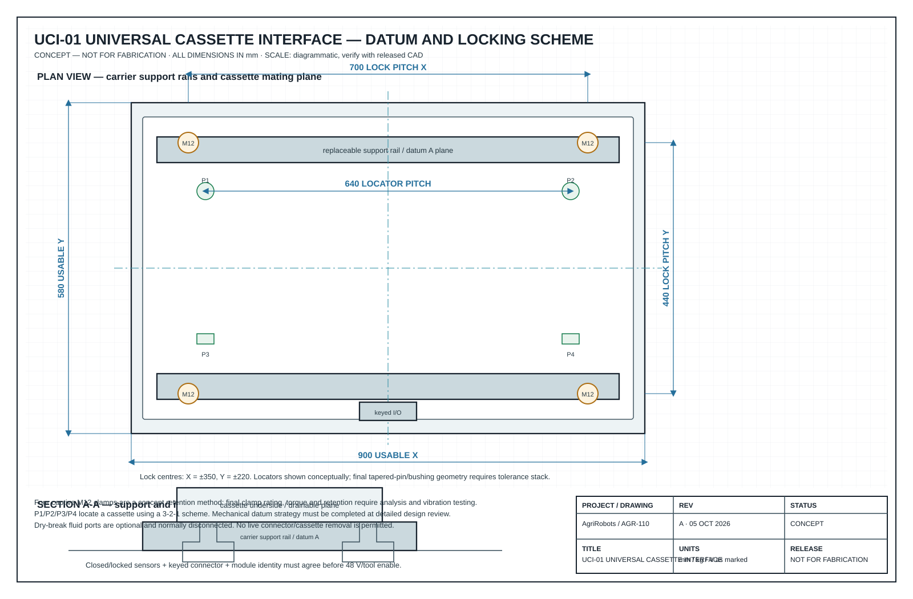
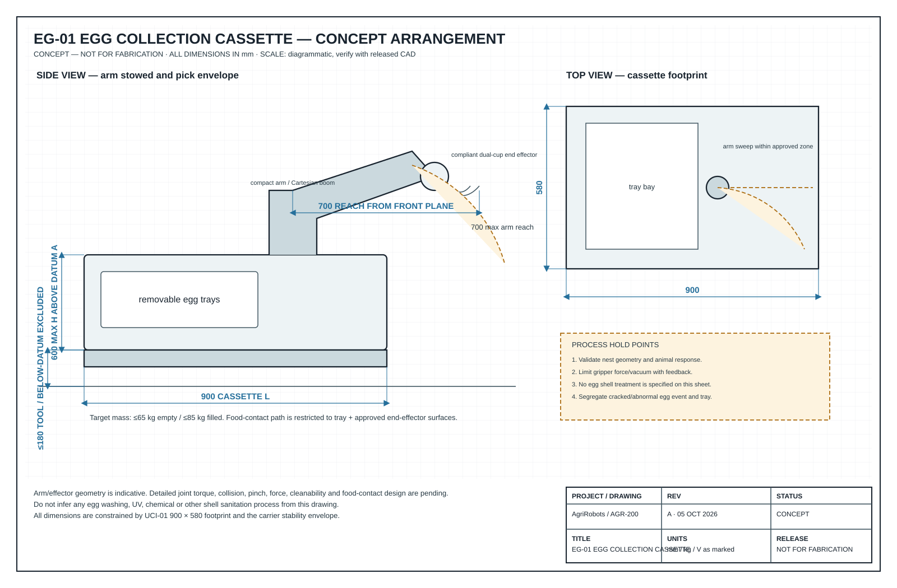
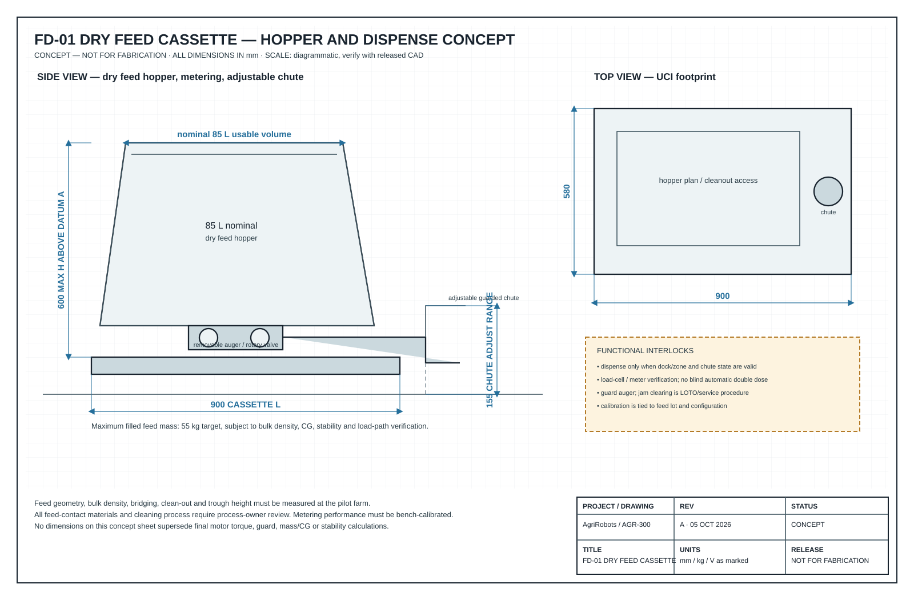
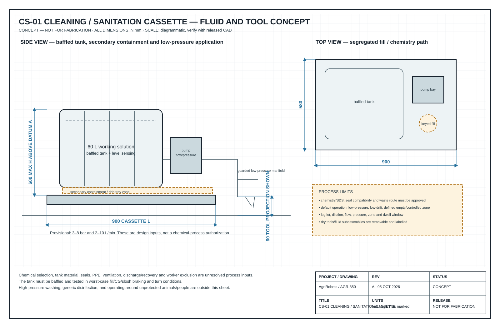
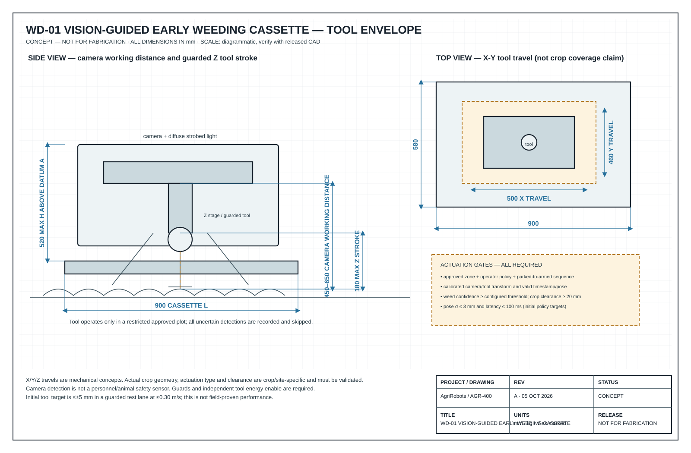

# 01 — Mechanical design

**Document:** AGR-DES-010 · **Revision:** A · **Status:** Concept / not for fabrication
Refer to [drawing index](../drawings/README.md). The drawings define the dimensional intent; this document explains why those dimensions were selected.

## 1. AP-01 carrier general arrangement

| Item | Specification / design target |
| --- | --- |
| Vehicle architecture | Battery-electric 4WD / 4-wheel steer mobile carrier, low deck, removable cassette, raised sensor mast |
| Outside envelope | 1,450 L × 780 W × 1,050 H (bumper to bumper; mast in transport height) |
| Wheelbase / tyre-centre track | 1,100 / 660 |
| Wheel / clearance | 420 OD × 100 W non-marking agricultural/all-terrain tyre; 160 nominal underbody clearance |
| Frame | Welded 6061-T6 or coated steel ladder frame **to be selected after FEA, corrosion, repair and cost trade**; sealed/isolated electronics pod; no load is carried by cosmetic covers |
| Drive | Four serviceable wheel modules, each nominally 48 V and 0.75 kW continuous; independent steering actuator; final ratios sized after grade/traction test |
| Steering | Coordinated 4WS: crab for row alignment, counter-phase for maneuvering. Steering angle/speed restrictions are enforced by vehicle mode. |
| Brakes | Normally-on electromechanical or spring-applied brake at each wheel/axle, independently safety-commanded; holding capacity and redundancy to be proven on the maximum approved grade/load |
| Rated cassette payload | 125 kg; permitted mass/CG is a *module manifest* property and must be checked before drive enable |
| Transport speed targets | 1.5 m/s maximum only after stopping-distance validation; 0.3 m/s docking/tool-near/limited-visibility initial cap; task speeds lower per cassette |
| Carrier dry mass target | 170–205 kg, excluding cassette; freeze after detailed design weigh-in |
| Ingress / washdown | IP-rated subsystem requirements set after cleaning procedure. No claim of whole-vehicle IP rating at concept stage. |

### Why this geometry

A 780 mm maximum outer width leaves a nominal 110 mm total lateral clearance in a 1,000 mm aisle; this is only a starting point for route planning and does not substitute for safety field clearance. The low 160 mm deck/underbody clearance is deliberately a compromise: it lowers the loaded centre of gravity for barn work but keeps the platform above modest thresholds/uneven ground. A raised, protected mast gives cameras/lidars a better line of sight, while task cameras remain on the cassette close to their work.

This is not a universal crop-straddling vehicle. A 750 mm crop-row system may demand a different track/undercarriage. Preserve AP-01's electrical/data/safety interface and create an **AP-02 adjustable field running gear** only after the survey proves it necessary; do not force crops to match the robot.

### Preliminary mass and CG control

| Group | Target mass (kg) | CG control |
| --- | ---:| --- |
| Welded frame, bumpers, covers | 55 | mass low and within wheel rectangle |
| Wheels, gearmotors, steering, brakes | 55 | symmetric, unsprung mass measured |
| Battery pack + service disconnect | 35–45 | tray below cassette plane, retained in crash/rollover analysis |
| Safety/compute/sensors/wiring | 25 | mast mass limited; sealed pod close to centre |
| **Carrier subtotal** | **170–205** | weigh every build |
| Approved cassette | 0–125 | manifest supplies mass, XYZ CG, tool envelope and fluid state |
| **Gross target** | **≤330** | stability/braking tests at worst approved CG, not an average module |

Do not release a 125 kg payload rating from this table. Structural FEA, wheel/tyre ratings, braking, thermal, static stability, dynamic turn, grade, and retained-load tests must set the final rated capacity.

## 2. Universal cassette interface (UCI-01)

### Mechanical contract

| Feature | Nominal design |
| --- | --- |
| Usable cassette envelope | 900 X × 580 Y × 600 Z above datum A; lower tool projection only in cassette safety envelope |
| Support plane (datum A) | Four replaceable wear pads on carrier rails; cassette underside is flat, drainable and keyed |
| Location | 3-2-1 principle: two tapered primary cones/pins at forward stations, one lateral constraint at rear-left, one vertical clamp at rear-right; exact bearing/clearance geometry is detailed at prototype CDR |
| Primary lock | Four captive M12 A4-80 clamps at X = ±350, Y = ±220 from bay centre; each has closed/locked sensing. Torque and retention verified by structural and vibration test. |
| Installation | De-energized manual exchange, support fixture/dolly required; module is lifted vertically, seated, latched in a declared sequence, then electronically authenticated. |
| Service life target | 1,000 exchange cycles before latch/wear-pad inspection interval is adjusted by test data |
| Deck and module material | Stainless/HDPE or coated metal in wet/product zones; isolate dissimilar materials to control galvanic corrosion |

A production revision may automate latching only after manual UCI-01 has passed contamination, misalignment, vibration, and unsafe-removal tests. “Quick-change” must not mean a cassette can be released while energized or while a tool is stored-energy hazardous.

### Electrical/data/fluid contract

| Channel | Carrier provision | Interlock / note |
| --- | --- | --- |
| Traction-independent auxiliary HV | 48 V nominal, 50 A continuous/75 A peak at connector (final derating after harness/thermal design) | Pre-charge, fuse, contactor and insulation monitoring; dead unless latch + safety enable valid |
| Low voltage | 24 V, 15 A protected | For controls/valves/lighting; each branch current monitored |
| Data | Dual 100BASE-T1 or industrial Ethernet plus CAN-FD service channel | EtherNet must be isolated/routed away from power; module serial/manifests signed |
| Safety discrete | Permit, latch closed, tool safe-state feedback, e-stop loop as required by safety concept | Hardwired; no sole dependence on DDS or Wi-Fi |
| Fluid (optional) | Two keyed, dry-break lines maximum in UCI-01 | **Not connected by default**; chemistry-specific seal, colour coding, drip tray, and dead-end policy |

The receptacle needs an IP-rated, touch-safe, mechanically keyed commercial connector family chosen at CDR. Do not select a connector purely by its catalogue current: temperature rise, washdown, mating cycles, voltage derating, emergency isolation, and service ergonomics must be tested.

## 3. Task cassettes

### EG-01 — egg collection cassette

| Parameter | Revision-A target |
| --- | ---:|
| Envelope | 900 L × 580 W × 600 H above UCI datum |
| Cassette empty / filled target | ≤65 / ≤85 kg (pending tray count/egg mass survey) |
| Manipulation | Compact 5/6-axis arm or Cartesian boom; 700 maximum reach measured from cassette front plane; compliant low-force end effector |
| End effector | Dual soft silicone vacuum cups with independent vacuum sensing, passive compliance and soft collision limit; food-contact material approval required |
| Perception | Close RGB-D/stereo camera and diffuse task light, shielded to avoid startling animals; no reliance on perception for safety |
| Storage | Removable, cleanable egg trays; each pick assigned tray slot and image/event record |
| Hygiene boundary | Food-contact path physically segregated from tire/cleaning-fluid path; equipment sanitation process pending validation |

**Egg process constraint:** The first pilot should collect, cradle, and trace eggs—not automatically wash/sanitize shell surfaces. Whether water washing, UV-C, chemicals, temperature changes, egg grading, and contact materials are permitted is a local food-safety process decision. EG-01 can include space, sensing, and records for an approved future treatment station but ships with that station blanked until validation.

### FD-01 — dry feed cassette

| Parameter | Revision-A target |
| --- | ---:|
| Envelope / usable hopper | 900 × 580 × 600 / 85 L nominal |
| Filled mass limit | 55 kg feed plus cassette self mass; final value uses feed bulk density and stability test |
| Metering | Agitated hopper, removable auger or rotary valve, load-cell or pulse/flow calibration, guarded adjustable chute |
| Dose range | 0.5–10 kg commanded setpoint, per-feed calibration; target ±5% at pilot |
| Animal interface | Chute height adjusted to surveyed trough; dispense while stopped unless risk assessment proves slow-motion dispensing is safe |
| Cleaning | Tool-free access where possible; no inaccessible ledges/product traps; food/feed-compatible materials and cleaning SOP |

The feed cassette must be re-calibrated whenever feed formulation, moisture, pellet size, auger, chute, or orientation changes. A missed dose is an event for the farm manager; a second unverified dose is not an automatic correction.

### CS-01 — cleaning and sanitation cassette

| Parameter | Revision-A target |
| --- | ---:|
| Envelope | 900 × 580 × 600 plus guarded tool projection below datum A |
| Fluid capacities | 60 L water/working solution + 10 L concentrate compartment maximum; exact chemistry/incompatibility assessment required |
| Wet application | Low-pressure, low-drift fan/nozzle manifold; target 3–8 bar, 2–10 L/min; flow and pressure logged |
| Dry cleaning tool | Removable scraper/brush or guarded vacuum head; selected by floor/manure survey; hard contact is force-limited |
| Recovery | Optional recovery/squeegee cartridge only after waste route is approved; no unapproved discharge to barn/field drainage |
| Segregation | Secondary containment, chemical-compatible tubing/seals, drip tray, fill keying, level/pressure/leak sensors |

Dry waste removal and wet disinfection often have incompatible sanitation and waste paths. CS-01 uses a common carrier but must have removable, labelled tool/fluid subassemblies and chemistry-specific checklists. Never mix concentrates or assume a chemical is compatible with egg/feed zones.

### WD-01 — vision-guided early weed cassette

| Parameter | Revision-A target |
| --- | ---:|
| Envelope | 900 × 580 × 520 above UCI datum; guarded tool zone to 180 below datum A |
| Camera / light | Down-looking global-shutter RGB camera, optional depth/near-IR, strobed diffuse light; 450–650 working distance adjustable |
| Actuator | Servo X-Y micro-positioner (500 × 460 travel) with Z 180 travel; interchangeable mechanical micro-hoes/finger tool or approved precision dispenser |
| Initial working speed | 0.15–0.30 m/s; speed is dynamically limited by pose uncertainty, latency and tool stopping distance |
| Tool accuracy target | ≤±5 mm at controlled test targets; crop exclusion radius starts at 20 mm and may only be reduced with data |
| Safety | Tool guard, physical parking position, deadman/tool-enable chain, pressure/force/encoder feedback; tool cannot arm during travel outside a work zone |

WD-01 must be crop-specific. “AI vision” includes a dataset, labels, lighting distribution, camera calibration, model version, confidence calibration, rejection behavior, and a monitored change process. A model that is accurate on a demo set is not a valid reason to actuate around young seedlings.

## 4. Mechanical fabrication and integration rules

1. **No open crevices in hygienic areas.** Radius internal corners where cleaning is needed; slope drain surfaces; do not put exposed threaded rods below food/feed or wet-processing paths.
2. **Separate clean and dirty zones.** Tyres, manure-facing tools, chemical lines, egg/feed contact, and electronics have defined routing and cleaning tools.
3. **Use replaceable sacrificial interfaces.** UCI wear pads, bumper skins, tool tips, nozzle caps, brushes, and cable glands are service parts.
4. **Design for a gloved operator.** Latches, isolators, filling ports, drain ports, and e-stops must be reachable when wearing site PPE; labels must survive washdown.
5. **Close every load path.** Provide structural drawings for arm reaction torque, filled hopper slosh, stop/turn inertia, recovery/towing, dock contact, and a tip-over restraint case.
6. **Validate vibration.** Fastener retention, connector fretting, battery retention, camera calibration, and latch sensor behavior must be tested on the actual floor/field profile.
7. **Protect sensor sightlines.** Mount wash shields and cleaning access without creating blind zones; verify lidar/camera fields with each cassette.

## 5. Release criteria before fabrication drawing release

- Site geometry and operating design domain frozen; target country/market named.
- Hazard analysis allocated every safety function to a validated hardware/software element.
- Mass properties calculated and verified against a representative module.
- Structural/weld FEA and drivetrain, thermal, brake, steering, grade, stability calculations reviewed by qualified engineers.
- P&ID and compatibility table released for every fluid; food-contact materials and cleaning process reviewed.
- CAD interference/tolerance analysis demonstrates cassette fit across production tolerances.
- Safety sensor coverage/model and stop-distance test plan are approved.
